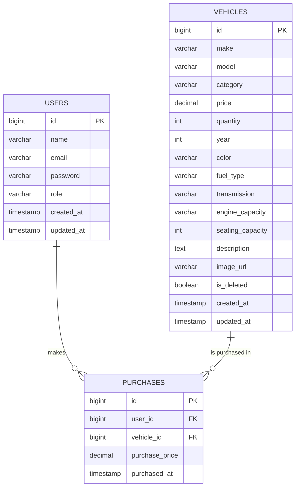
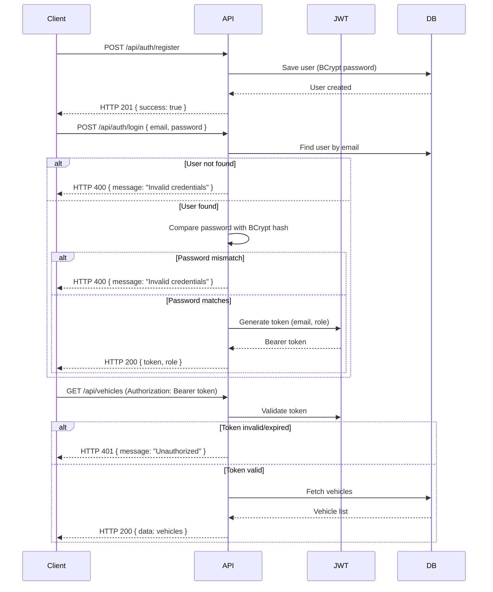
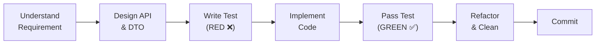

# Car Dealership Inventory System — System Design

## 1. Overview

A full-stack Car Dealership Inventory System that allows users to browse, search, and purchase vehicles while admins manage inventory (add, update, delete, restock). Built with clean architecture, Test-Driven Development, and feature-based code organization.

---

## 2. Tech Stack

### Backend

| Layer          | Technology                  |
|----------------|-----------------------------|
| Language       | Java 21                     |
| Framework      | Spring Boot 3.x             |
| Security       | Spring Security + JWT       |
| ORM            | Spring Data JPA (Hibernate) |
| Database       | PostgreSQL                  |
| Image Upload   | Cloudinary                  |
| Build Tool     | Maven                       |
| Testing        | JUnit 5 + Mockito           |

### Frontend

| Layer       | Technology       |
|-------------|------------------|
| Library     | React (JavaScript) |
| Build Tool  | Vite             |
| Styling     | Tailwind CSS     |
| Routing     | React Router v6  |
| HTTP Client | Axios            |

### Integrations

| Service    | Purpose                         | Status            |
|------------|----------------------------------|--------------------|
| Cloudinary | Vehicle image upload & storage  | Configured         |
| Razorpay   | Payment gateway for purchases   | Env vars only      |

### Deployment

| Component  | Platform         |
|------------|------------------|
| Backend    | Render           |
| Frontend   | Vercel           |
| Database   | Neon PostgreSQL  |

---

## 3. Architecture

```
React Frontend (Vite + Tailwind CSS)
        ↓  HTTP (Axios)
   REST API Layer
        ↓
   Controller (Request/Response handling)
        ↓
   Mapper (Entity ↔ DTO conversion)
        ↓
   Service Interface (Contract)
        ↓
   Service Implementation (Business Logic)
        ↓
   Repository (Spring Data JPA)
        ↓
   PostgreSQL Database
```

**Rules:**
- All business logic lives exclusively inside the Service Implementation layer.
- Controllers are thin — request parsing, validation delegation, response formatting only.
- Mappers handle entity ↔ DTO conversion, keeping services clean.
- Third-party integrations live in `integrations/` with their own interface + implementation.

### Package Structure

```
com.incubyte.backend/
├── config/                          # Security, JWT, CORS configs
├── common/                          # ApiResponse, GlobalExceptionHandler
├── auth/                            # Auth controller, DTOs, service, mapper
│   ├── dto/
│   │   ├── request/
│   │   │   ├── RegisterRequest.java
│   │   │   └── LoginRequest.java
│   │   └── response/
│   │       └── AuthResponse.java
│   ├── AuthController.java
│   ├── AuthService.java
│   ├── AuthServiceImpl.java
│   └── AuthMapper.java
├── user/                            # User entity, repository
│   ├── User.java
│   ├── UserRepository.java
│   └── Role.java
├── vehicle/                         # Vehicle entity, repository, controller, service, DTOs, mapper
│   ├── dto/
│   │   ├── request/
│   │   │   └── VehicleRequest.java
│   │   └── response/
│   │       └── VehicleResponse.java
│   ├── Vehicle.java
│   ├── VehicleRepository.java
│   ├── VehicleController.java
│   ├── VehicleService.java
│   ├── VehicleServiceImpl.java
│   └── VehicleMapper.java
├── inventory/                       # Purchase + Restock (InventoryController)
│   ├── dto/
│   │   ├── request/
│   │   │   └── RestockRequest.java
│   │   └── response/
│   │       └── PurchaseResponse.java
│   ├── Purchase.java
│   ├── PurchaseRepository.java
│   ├── InventoryController.java
│   ├── InventoryService.java
│   ├── InventoryServiceImpl.java
│   └── PurchaseMapper.java
├── integrations/                    # Third-party service integrations
│   ├── cloudinary/
│   │   ├── CloudinaryConfig.java
│   │   ├── CloudinaryService.java
│   │   └── CloudinaryServiceImpl.java
│   └── razorpay/
│       └── RazorpayConfig.java
└── seeder/                          # DatabaseSeeder (admin user)
    └── DatabaseSeeder.java
```

> **Note:** Mappers are manual (no MapStruct). Each feature package has its own mapper class (e.g., `VehicleMapper.toResponse(entity)`) to keep entity ↔ DTO conversion out of the service layer.

---

## 4. Database Design

### 4.1 Table: `users`

| Column       | Type          | Constraints                    |
|--------------|---------------|--------------------------------|
| `id`         | BIGINT (PK)   | Auto-generated                 |
| `name`       | VARCHAR(100)  | NOT NULL                       |
| `email`      | VARCHAR(255)  | NOT NULL, UNIQUE               |
| `password`   | VARCHAR(255)  | NOT NULL (BCrypt hashed)       |
| `role`       | VARCHAR(20)   | NOT NULL, DEFAULT `ROLE_USER`  |
| `created_at` | TIMESTAMP     | NOT NULL                       |
| `updated_at` | TIMESTAMP     | NOT NULL                       |

### 4.2 Table: `vehicles`

| Column             | Type           | Constraints                     | Required?    |
|--------------------|----------------|---------------------------------|--------------|
| `id`               | BIGINT (PK)    | Auto-generated                  | —            |
| `make`             | VARCHAR(100)   | NOT NULL                        | Required     |
| `model`            | VARCHAR(100)   | NOT NULL                        | Required     |
| `category`         | VARCHAR(50)    | NOT NULL                        | Required     |
| `price`            | DECIMAL(12,2)  | NOT NULL, CHECK ≥ 0             | Required     |
| `quantity`         | INTEGER        | NOT NULL, CHECK ≥ 0             | Required     |
| `year`             | INTEGER        | NULLABLE                        | Optional     |
| `color`            | VARCHAR(50)    | NULLABLE                        | Optional     |
| `fuel_type`        | VARCHAR(30)    | NULLABLE                        | Optional     |
| `transmission`     | VARCHAR(30)    | NULLABLE                        | Optional     |
| `engine_capacity`  | VARCHAR(20)    | NULLABLE                        | Optional     |
| `seating_capacity` | INTEGER        | NULLABLE                        | Optional     |
| `description`      | TEXT           | NULLABLE                        | Optional     |
| `image_url`        | VARCHAR(500)   | NULLABLE (Cloudinary URL)       | Optional     |
| `is_deleted`       | BOOLEAN        | NOT NULL, DEFAULT `false`       | — (internal) |
| `created_at`       | TIMESTAMP      | NOT NULL                        | —            |
| `updated_at`       | TIMESTAMP      | NOT NULL                        | —            |

**Soft Delete:** Vehicles are never permanently deleted. The `is_deleted` column is set to `true` on deletion. This preserves purchase history since `purchases` references `vehicle_id`. All list/search queries filter `WHERE is_deleted = false`.

**Why optional fields instead of inheritance?** A single `vehicles` table with nullable columns avoids the complexity of JPA inheritance strategies (SINGLE_TABLE / JOINED / TABLE_PER_CLASS). The `category` field identifies the vehicle type, and optional fields like `engine_capacity` (null for EVs) or `fuel_type` ("Electric" for EVs) naturally handle type-specific data. This follows the Open/Closed Principle — new vehicle types are added by populating different optional fields without modifying entity code.

### 4.3 Table: `purchases`

| Column           | Type           | Constraints            |
|------------------|----------------|------------------------|
| `id`             | BIGINT (PK)    | Auto-generated         |
| `user_id`        | BIGINT (FK)    | NOT NULL → users.id    |
| `vehicle_id`     | BIGINT (FK)    | NOT NULL → vehicles.id |
| `purchase_price` | DECIMAL(12,2)  | NOT NULL               |
| `purchased_at`   | TIMESTAMP      | NOT NULL               |

### 4.4 Entity Relationships



### 4.5 Vehicle Entity — Builder Pattern

```java
@Entity
@Getter
@Setter
@NoArgsConstructor
@AllArgsConstructor
@Builder
public class Vehicle {
    @Id
    @GeneratedValue(strategy = GenerationType.IDENTITY)
    private Long id;

    // required fields
    @Column(nullable = false)
    private String make;

    @Column(nullable = false)
    private String model;

    @Column(nullable = false)
    private String category;

    @Column(nullable = false, precision = 12, scale = 2)
    private BigDecimal price;

    @Column(nullable = false)
    private Integer quantity;

    // optional fields — set via Builder
    private Integer year;
    private String color;
    private String fuelType;
    private String transmission;
    private String engineCapacity;
    private Integer seatingCapacity;

    @Column(columnDefinition = "TEXT")
    private String description;

    private String imageUrl;

    // soft delete
    @Builder.Default
    @Column(name = "is_deleted", nullable = false)
    private Boolean isDeleted = false;

    @Column(nullable = false, updatable = false)
    private LocalDateTime createdAt;

    @Column(nullable = false)
    private LocalDateTime updatedAt;
}
```

**Usage examples:**

```java
// Sedan
Vehicle car = Vehicle.builder()
    .make("Toyota").model("Camry").category("Sedan")
    .price(new BigDecimal("25000")).quantity(5)
    .year(2024).color("White").fuelType("Petrol")
    .transmission("Automatic").engineCapacity("2.5L")
    .seatingCapacity(5)
    .build();

// Electric Vehicle — engineCapacity is null (not applicable)
Vehicle ev = Vehicle.builder()
    .make("Tesla").model("Model 3").category("Electric")
    .price(new BigDecimal("45000")).quantity(3)
    .year(2024).color("Black").fuelType("Electric")
    .transmission("Automatic").seatingCapacity(5)
    .build();

// Truck — color and description are null
Vehicle truck = Vehicle.builder()
    .make("Ford").model("F-150").category("Truck")
    .price(new BigDecimal("55000")).quantity(2)
    .year(2024).fuelType("Diesel")
    .engineCapacity("3.5L").seatingCapacity(3)
    .build();
```

---

## 5. API Specification

### 5.1 Standard Response Format

```json
{
  "success": true,
  "message": "Operation successful",
  "data": { },
  "errors": null
}
```

No `statusCode` in the response body — the HTTP status code (200, 201, 400, 404, 500) is sent in the response header. The frontend reads `response.status` from Axios.

### 5.2 Authentication Endpoints (Public)

| Method | Endpoint              | Description           | HTTP Status |
|--------|-----------------------|-----------------------|-------------|
| POST   | `/api/auth/register`  | Register a new user   | 201         |
| POST   | `/api/auth/login`     | Login and receive JWT | 200         |

**Register Request:**
```json
{
  "name": "John Doe",
  "email": "john@example.com",
  "password": "password123"
}
```

**Login Request:**
```json
{
  "email": "john@example.com",
  "password": "password123"
}
```

**Login Response:**
```json
{
  "success": true,
  "message": "Login successful",
  "data": {
    "token": "eyJhbGciOiJIUzI1NiIs...",
    "email": "john@example.com",
    "role": "ROLE_USER"
  }
}
```

### 5.3 Vehicle Endpoints (Protected — JWT Required)

| Method | Endpoint                  | Description                   | Access     | HTTP Status |
|--------|---------------------------|-------------------------------|------------|-------------|
| POST   | `/api/vehicles`           | Add a new vehicle             | ADMIN      | 201         |
| GET    | `/api/vehicles`           | List all vehicles (paginated) | USER/ADMIN | 200         |
| GET    | `/api/vehicles/{id}`      | Get vehicle by ID             | USER/ADMIN | 200         |
| GET    | `/api/vehicles/search`    | Search vehicles               | USER/ADMIN | 200         |
| PUT    | `/api/vehicles/{id}`      | Update vehicle details        | ADMIN      | 200         |
| DELETE | `/api/vehicles/{id}`      | Soft-delete a vehicle         | ADMIN      | 200         |

**Search Query Parameters:** `?make=`, `?model=`, `?category=`, `?minPrice=`, `?maxPrice=`

**Pagination Parameters:** `?page=0&size=20` (default page size = 20)

**Vehicle Request:**
```json
{
  "make": "Toyota",
  "model": "Camry",
  "category": "Sedan",
  "price": 25000.00,
  "quantity": 5,
  "year": 2024,
  "color": "White",
  "fuelType": "Petrol",
  "transmission": "Automatic",
  "engineCapacity": "2.5L",
  "seatingCapacity": 5,
  "description": "A reliable mid-size sedan"
}
```

**Vehicle Response:**
```json
{
  "id": 1,
  "make": "Toyota",
  "model": "Camry",
  "category": "Sedan",
  "price": 25000.00,
  "quantity": 5,
  "year": 2024,
  "color": "White",
  "fuelType": "Petrol",
  "transmission": "Automatic",
  "engineCapacity": "2.5L",
  "seatingCapacity": 5,
  "description": "A reliable mid-size sedan",
  "imageUrl": "https://res.cloudinary.com/...",
  "createdAt": "2026-07-12T01:00:00",
  "updatedAt": "2026-07-12T01:00:00"
}
```

### 5.4 Inventory Endpoints (Protected — JWT Required)

| Method | Endpoint                         | Description                    | Access     | HTTP Status |
|--------|----------------------------------|--------------------------------|------------|-------------|
| POST   | `/api/vehicles/{id}/purchase`    | Purchase a vehicle (qty − 1)   | USER/ADMIN | 200         |
| POST   | `/api/vehicles/{id}/restock`     | Restock a vehicle              | ADMIN      | 200         |

**Purchase Response:**
```json
{
  "success": true,
  "message": "Vehicle purchased successfully",
  "data": {
    "vehicleId": 1,
    "make": "Toyota",
    "model": "Camry",
    "purchasePrice": 25000.00,
    "remainingStock": 4,
    "purchasedAt": "2026-07-12T01:00:00"
  }
}
```

**Restock Request:**
```json
{
  "quantity": 10
}
```

---

## 6. Authentication Flow



**Key decisions:**
- BCrypt password encoding
- Stateless authentication (no server-side sessions)
- Bearer token in `Authorization` header
- No OAuth, no social login, no refresh tokens
- Admin seeded via `CommandLineRunner` on first startup (`admin@cardealership.com` / `admin123`)

---

## 7. User Roles & Access Control

| Capability          | ROLE_USER | ROLE_ADMIN |
|---------------------|-----------|------------|
| Register            | ✅        | —          |
| Login               | ✅        | ✅         |
| View Vehicles       | ✅        | ✅         |
| Search Vehicles     | ✅        | ✅         |
| Purchase Vehicle    | ✅        | ✅         |
| Add Vehicle         | ❌        | ✅         |
| Update Vehicle      | ❌        | ✅         |
| Delete Vehicle      | ❌        | ✅         |
| Restock Vehicle     | ❌        | ✅         |

Admin is created via `DatabaseSeeder` (`CommandLineRunner`), not through registration.

---

## 8. Validation Rules

### User Registration

| Field      | Rule                              |
|------------|-----------------------------------|
| `name`     | Required, 2–100 characters        |
| `email`    | Required, valid email, unique     |
| `password` | Required, minimum 6 characters   |

### Vehicle — Required Fields

| Field      | Rule                  |
|------------|-----------------------|
| `make`     | Required, non-blank   |
| `model`    | Required, non-blank   |
| `category` | Required, non-blank   |
| `price`    | Required, ≥ 0         |
| `quantity` | Required, ≥ 0         |

### Vehicle — Optional Fields

| Field             | Rule             | Notes                             |
|-------------------|------------------|-----------------------------------|
| `year`            | Positive integer | Manufacture year                  |
| `color`           | String           | Exterior color                    |
| `fuelType`        | String           | Petrol, Diesel, Electric, Hybrid  |
| `transmission`    | String           | Manual, Automatic, CVT            |
| `engineCapacity`  | String           | e.g. "2.0L", null for EVs        |
| `seatingCapacity` | Positive integer | Varies by vehicle type            |
| `description`     | Text             | Free-form description             |
| `image`           | File             | Cloudinary upload → `image_url`   |

### Purchase

| Rule                         | Error  |
|------------------------------|--------|
| Vehicle must exist           | 404    |
| Vehicle must not be deleted  | 400    |
| Stock must be available      | 400    |

### Restock

| Rule            | Error  |
|-----------------|--------|
| Admin only      | 403    |
| Quantity > 0    | 400    |

---

## 9. Frontend Pages

### Public

| Page     | Route       | Description                         |
|----------|-------------|-------------------------------------|
| Home     | `/`         | Hero section, CTA to login/register |
| Login    | `/login`    | Email + password form               |
| Register | `/register` | Name + email + password form        |

### User (Authenticated)

| Page           | Route            | Description                                      |
|----------------|------------------|--------------------------------------------------|
| Dashboard      | `/dashboard`     | Vehicle listing with search/filter + paginated infinite scroll |
| Vehicle Detail | `/vehicles/{id}` | Vehicle info + purchase button                   |

### Admin (Admin Only)

| Page            | Route                       | Description                       |
|-----------------|-----------------------------|------------------------------------|
| Admin Dashboard | `/admin`                    | Admin overview with vehicle table |
| Add Vehicle     | `/admin/vehicles/new`       | Form with image upload            |
| Edit Vehicle    | `/admin/vehicles/{id}/edit` | Pre-filled edit form              |

### Error Pages

| Page         | Description             |
|--------------|-------------------------|
| 404          | Page not found          |
| Unauthorized | Not logged in           |
| Forbidden    | Insufficient permissions |

---

## 10. Environment Variables

### Backend `.env`

```properties
# Database
DB_URL=jdbc:postgresql://localhost:5432/cardealership
DB_USERNAME=postgres
DB_PASSWORD=postgres

# JWT
JWT_SECRET=your-jwt-secret-key-here
JWT_EXPIRATION=86400000

# Cloudinary
CLOUDINARY_CLOUD_NAME=your-cloud-name
CLOUDINARY_API_KEY=your-api-key
CLOUDINARY_API_SECRET=your-api-secret

# Razorpay (future integration)
RAZORPAY_KEY_ID=your-razorpay-key-id
RAZORPAY_KEY_SECRET=your-razorpay-key-secret

# Admin Seed
ADMIN_EMAIL=admin@cardealership.com
ADMIN_PASSWORD=admin123
```

### Frontend `.env`

```properties
VITE_API_BASE_URL=http://localhost:8080/api
VITE_RAZORPAY_KEY_ID=your-razorpay-key-id
```

`.env` files are added to `.gitignore`. A `.env.example` with placeholder values is committed instead.

---

## 11. Design Decisions

| Decision                               | Rationale                                                                                     |
|----------------------------------------|-----------------------------------------------------------------------------------------------|
| `@Builder` on Vehicle entity           | Optional fields are cleanly set without telescoping constructors                              |
| Single table for all vehicle types     | Avoids JPA inheritance complexity; category + optional fields handle Cars/Trucks/Vans/EVs     |
| Soft delete for vehicles               | Purchases reference vehicle_id — hard delete would break FK integrity and lose history        |
| Mappers inside feature packages        | Entity ↔ DTO conversion stays out of services. `VehicleMapper.toResponse(entity)` keeps them clean |
| `integrations/` package                | Third-party services isolated with their own config + service + serviceImpl                   |
| `BigDecimal` for price                 | Avoids floating-point precision errors with money                                             |
| Java Records for DTOs                  | Immutable, concise, modern Java                                                               |
| `String` for category/fuelType/transmission | Flexible — no DB migration or code change needed for new values                          |
| `CommandLineRunner` for admin seed     | Auto-creates default admin on first startup                                                   |
| Purchases table                        | Maintains purchase history for audit/reporting                                                |
| Service + ServiceImpl                  | Interface-based design for testability and SOLID compliance                                   |
| Feature-wise packaging                 | Better cohesion than layer-based packaging                                                    |
| Global Exception Handler              | Consistent error responses across all endpoints                                               |
| Cloudinary in `integrations/cloudinary/` | Modular — easy to swap or extend without touching vehicle code                              |
| Rich purchase response                 | Returns vehicleId, remainingStock, purchasePrice — frontend updates instantly                 |
| HTTP status only (no statusCode in body) | Cleaner response; frontend uses `response.status` from Axios                               |
| Paginated infinite scroll            | Backend pagination (Spring Pageable) + frontend auto-loads next page on scroll              |

---

## 12. SOLID Compliance

| Principle                  | How it's satisfied                                                                                          |
|----------------------------|-------------------------------------------------------------------------------------------------------------|
| **Single Responsibility**  | Vehicle entity holds data. VehicleMapper handles conversion. VehicleServiceImpl handles logic. CloudinaryServiceImpl handles uploads. |
| **Open/Closed**            | New vehicle types added via optional fields + new category string. New integrations in `integrations/` without modifying existing code. |
| **Liskov Substitution**    | Not applicable (no inheritance). Using composition via optional fields instead.                             |
| **Interface Segregation**  | VehicleService, CloudinaryService, InventoryService — each has focused methods.                            |
| **Dependency Inversion**   | Controllers → Service interfaces. VehicleServiceImpl → CloudinaryService (interface).                      |

---

## 13. TDD Workflow

Every backend feature follows this cycle:



**Commit pattern:**
1. `test: ...` — Tests written, all RED
2. `feat: ...` — Implementation done, all GREEN
3. `refactor: ...` (if needed)
