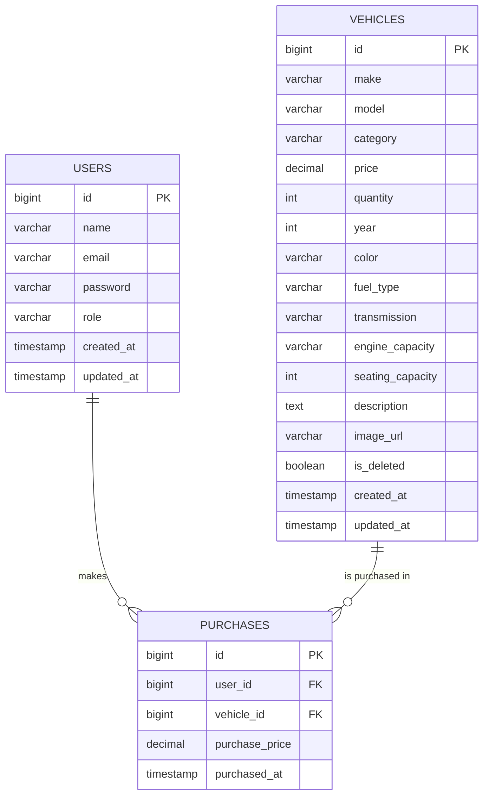
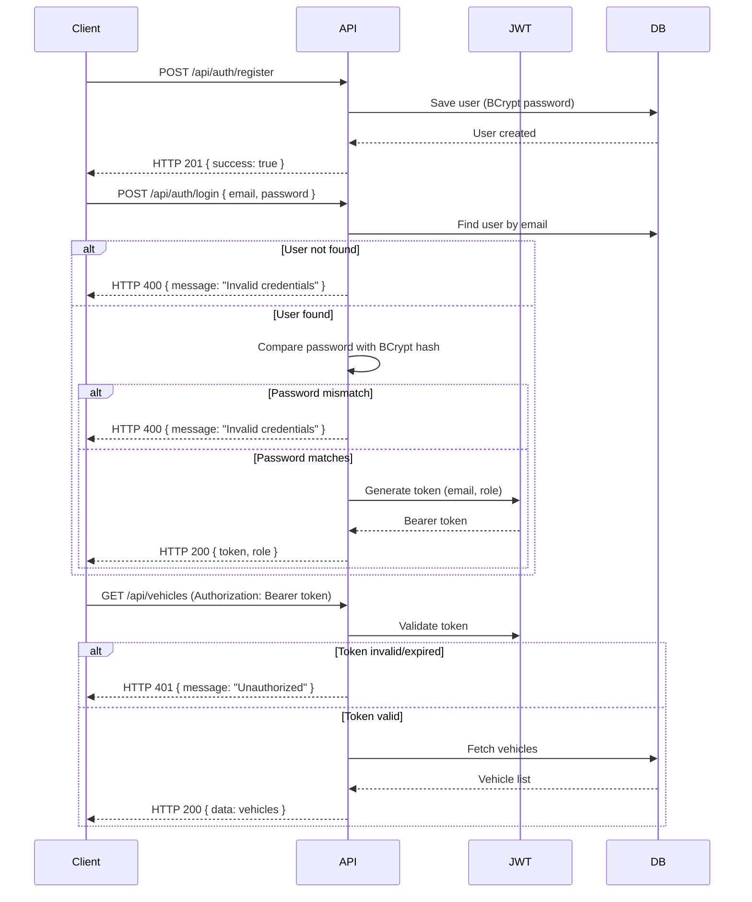
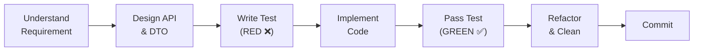

# Car Dealership Inventory System — Complete Build Plan

## 1. Project Overview

A **full-stack Car Dealership Inventory System** built as a first-round on-campus recruitment assessment. The system allows users to browse, search, and purchase vehicles while admins can manage inventory (add, update, delete, restock). The project emphasises **clean architecture**, **Test-Driven Development (TDD)**, **meaningful Git history**, and **transparent AI usage**.

> [!IMPORTANT]
> This is a full-stack Car Dealership Inventory System built as an assessment project designed for 1–2 day implementation. Every backend feature follows a strict Red → Green → Refactor → Commit TDD cycle.

---

## 2. Assessment Requirements Checklist

| # | Requirement | Status |
|---|-------------|--------|
| 1 | RESTful Backend API | `[ ]` |
| 2 | Persistent Database (PostgreSQL) | `[ ]` |
| 3 | User Registration & Login | `[ ]` |
| 4 | JWT Token-based Authentication | `[ ]` |
| 5 | Vehicle CRUD (Protected) | `[ ]` |
| 6 | Vehicle Search (make, model, category, price range) | `[ ]` |
| 7 | Purchase Vehicle (decrease quantity) | `[ ]` |
| 8 | Restock Vehicle (Admin only) | `[ ]` |
| 9 | Frontend SPA (React) | `[ ]` |
| 10 | User Registration & Login Forms | `[ ]` |
| 11 | Dashboard with Vehicle Listing | `[ ]` |
| 12 | Search & Filter UI | `[ ]` |
| 13 | Purchase Button (disabled when qty = 0) | `[ ]` |
| 14 | Admin UI (Add, Update, Delete, Restock) | `[ ]` |
| 15 | TDD with Red-Green-Refactor commits | `[ ]` |
| 16 | Clean Code (SOLID, Documentation) | `[ ]` |
| 17 | Meaningful Git History (25-30 commits) | `[ ]` |
| 18 | AI Co-authorship in commits | `[ ]` |
| 19 | Comprehensive README.md | `[ ]` |
| 20 | Test Report | `[ ]` |
| 21 | Screenshots in README | `[ ]` |
| 22 | Deployment (Bonus) | `[ ]` |
| 23 | Cloudinary Image Upload | `[ ]` |
| 24 | Razorpay Payment Gateway (env ready) | `[ ]` |
| 25 | Infinite Scroll Pagination | `[ ]` |

---

## 3. Tech Stack

### Backend
| Layer | Technology |
|-------|-----------|
| Language | Java 21 |
| Framework | Spring Boot 3.x |
| Security | Spring Security + JWT |
| ORM | Spring Data JPA (Hibernate) |
| Database | PostgreSQL |
| Image Upload | Cloudinary |
| Build Tool | Maven |
| Testing | JUnit 5 + Mockito |

### Frontend
| Layer | Technology |
|-------|-----------|
| Library | React (JavaScript) |
| Build Tool | Vite |
| Styling | Tailwind CSS |
| Routing | React Router v6 |
| HTTP Client | Axios |

### Integrations
| Service | Purpose | 
|---------|---------|
| Cloudinary | Vehicle image upload & storage
| Razorpay | Payment gateway for purchases | 

### Deployment
| Component | Platform |
|-----------|----------|
| Backend | Render |
| Frontend | Vercel |
| Database | Neon PostgreSQL |

---

## 4. Architecture

```
React Frontend (Vite + Tailwind CSS)
        ↓  HTTP (Axios)
   REST API Layer
        ↓
   Controller (Request/Response handling)
        ↓
   Service Interface (Contract)
        ↓
   Service Implementation (Business Logic)
        ↓
   Repository (Spring Data JPA)
        ↓
   PostgreSQL Database
```

> [!NOTE]
> All business logic lives exclusively inside the **Service Implementation** layer. Controllers are thin — they only handle request parsing, validation delegation, and response formatting.

### Package Structure (Feature-wise)
```
com.incubyte.backend/
├── config/                          # Security, JWT, CORS configs
├── common/                          # ApiResponse, GlobalExceptionHandler
├── auth/                            # Auth controller, DTOs, service, mapper
│   ├── dto/request/
│   ├── dto/response/
│   └── AuthMapper.java
├── user/                            # User entity, repository
├── vehicle/                         # Vehicle entity, repository, controller, service, DTOs, mapper
│   ├── dto/request/
│   ├── dto/response/
│   └── VehicleMapper.java
├── inventory/                       # Purchase + Restock (InventoryController)
│   ├── dto/request/
│   ├── dto/response/
│   └── PurchaseMapper.java
├── integrations/                    # Third-party service integrations
│   ├── cloudinary/                  # Cloudinary config, service, serviceImpl
│   │   ├── CloudinaryConfig.java
│   │   ├── CloudinaryService.java
│   │   └── CloudinaryServiceImpl.java
│   └── razorpay/                    # Razorpay (future — env vars ready)
│       └── RazorpayConfig.java
└── seeder/                          # DatabaseSeeder (admin user)
```

> [!NOTE]
> **Manual mappers** (no MapStruct) live inside their feature package (e.g., `vehicle/VehicleMapper.java`). This keeps entity ↔ DTO conversion out of the service layer, following Single Responsibility.

---

## 5. Database Design

### Table: `users`
| Column | Type | Constraints |
|--------|------|------------|
| `id` | BIGINT (PK) | Auto-generated |
| `name` | VARCHAR(100) | NOT NULL |
| `email` | VARCHAR(255) | NOT NULL, UNIQUE |
| `password` | VARCHAR(255) | NOT NULL (BCrypt) |
| `role` | VARCHAR(20) | NOT NULL, DEFAULT `ROLE_USER` |
| `created_at` | TIMESTAMP | NOT NULL |
| `updated_at` | TIMESTAMP | NOT NULL |

### Table: `vehicles`
| Column | Type | Constraints | Required? |
|--------|------|------------|----------|
| `id` | BIGINT (PK) | Auto-generated | — |
| `make` | VARCHAR(100) | NOT NULL |  Required |
| `model` | VARCHAR(100) | NOT NULL |  Required |
| `category` | VARCHAR(50) | NOT NULL | Required |
| `price` | DECIMAL(12,2) | NOT NULL, CHECK ≥ 0 |  Required |
| `quantity` | INTEGER | NOT NULL, CHECK ≥ 0 |  Required |
| `year` | INTEGER | NULLABLE | Optional |
| `color` | VARCHAR(50) | NULLABLE | Optional |
| `fuel_type` | VARCHAR(30) | NULLABLE | Optional |
| `transmission` | VARCHAR(30) | NULLABLE | Optional |
| `engine_capacity` | VARCHAR(20) | NULLABLE | Optional |
| `seating_capacity` | INTEGER | NULLABLE | Optional |
| `description` | TEXT | NULLABLE | Optional |
| `image_url` | VARCHAR(500) | NULLABLE (Cloudinary URL) | Optional |
| `is_deleted` | BOOLEAN | NOT NULL, DEFAULT `false` | — (internal) |
| `created_at` | TIMESTAMP | NOT NULL | — |
| `updated_at` | TIMESTAMP | NOT NULL | — |

> [!CAUTION]
> **Soft Delete**: Vehicles are never permanently deleted from the database. The `is_deleted` column is set to `true` on deletion. This is critical because the `purchases` table references `vehicle_id` — hard deleting a vehicle would break purchase history. All queries that list/search vehicles must filter `WHERE is_deleted = false`.

> [!NOTE]
> **Why optional fields instead of inheritance?** Using a single `vehicles` table with nullable optional columns keeps the schema simple and avoids the complexity of JPA inheritance strategies (SINGLE_TABLE / JOINED / TABLE_PER_CLASS). The `category` field (String) identifies the vehicle type, and optional fields like `engine_capacity` (null for EVs) or `fuel_type` ("Electric" for EVs) naturally handle type-specific data. This follows the **Open/Closed Principle** — we can add new vehicle types by just populating different optional fields without modifying entity code.

**Builder Pattern Usage:**
```java
@Entity
@Getter
@Setter
@NoArgsConstructor
@AllArgsConstructor
@Builder
public class Vehicle {
    // required fields
    private String make;
    private String model;
    private String category;
    private BigDecimal price;
    private Integer quantity;

    // optional fields — set via Builder
    private Integer year;
    private String color;
    private String fuelType;
    private String transmission;
    private String engineCapacity;
    private Integer seatingCapacity;
    private String description;
    private String imageUrl;

    // soft delete
    @Builder.Default
    private Boolean isDeleted = false;
}
```

**Example — creating different vehicle types:**
```java
// Car
Vehicle car = Vehicle.builder()
    .make("Toyota").model("Camry").category("Sedan")
    .price(new BigDecimal("25000")).quantity(5)
    .year(2024).color("White").fuelType("Petrol")
    .transmission("Automatic").engineCapacity("2.5L")
    .seatingCapacity(5)
    .build();

// Electric Vehicle
Vehicle ev = Vehicle.builder()
    .make("Tesla").model("Model 3").category("Electric")
    .price(new BigDecimal("45000")).quantity(3)
    .year(2024).color("Black").fuelType("Electric")
    .transmission("Automatic")
    .seatingCapacity(5)
    .build();  // engineCapacity is null — not applicable

// Truck
Vehicle truck = Vehicle.builder()
    .make("Ford").model("F-150").category("Truck")
    .price(new BigDecimal("55000")).quantity(2)
    .year(2024).fuelType("Diesel")
    .engineCapacity("3.5L").seatingCapacity(3)
    .build();  // color, description are null
```

### Table: `purchases`
| Column | Type | Constraints |
|--------|------|------------|
| `id` | BIGINT (PK) | Auto-generated |
| `user_id` | BIGINT (FK → users) | NOT NULL |
| `vehicle_id` | BIGINT (FK → vehicles) | NOT NULL |
| `purchase_price` | DECIMAL(12,2) | NOT NULL |
| `purchased_at` | TIMESTAMP | NOT NULL |

### Entity Relationships


---

## 6. API Specification

### Standard API Response Format
```json
{
  "success": true,
  "message": "Operation successful",
  "data": { },
  "errors": null
}
```

> [!NOTE]
> No `statusCode` in the response body — we rely on the HTTP status code (200, 201, 400, 404, 500) sent in the response header. The frontend reads `response.status` from Axios.

### Authentication Endpoints (Public)

| Method | Endpoint | Description | Status Code |
|--------|----------|-------------|-------------|
| POST | `/api/auth/register` | Register a new user | 201 |
| POST | `/api/auth/login` | Login and receive JWT | 200 |

### Vehicle Endpoints (Protected — JWT Required)

| Method | Endpoint | Description | Access | Status Code |
|--------|----------|-------------|--------|-------------|
| POST | `/api/vehicles` | Add a new vehicle | ADMIN | 201 |
| GET | `/api/vehicles` | List all vehicles (paginated) | USER, ADMIN | 200 |
| GET | `/api/vehicles/{id}` | Get vehicle by ID | USER, ADMIN | 200 |
| GET | `/api/vehicles/search` | Search vehicles | USER, ADMIN | 200 |
| PUT | `/api/vehicles/{id}` | Update vehicle details | ADMIN | 200 |
| DELETE | `/api/vehicles/{id}` | Soft-delete a vehicle | ADMIN | 200 |

**Search Query Parameters**: `?make=`, `?model=`, `?category=`, `?minPrice=`, `?maxPrice=`
**Pagination Parameters**: `?page=0&size=20` (default page size = 20)

### Inventory Endpoints (Protected — JWT Required)

| Method | Endpoint | Description | Access | Status Code |
|--------|----------|-------------|--------|-------------|
| POST | `/api/vehicles/{id}/purchase` | Purchase a vehicle (qty − 1) | USER, ADMIN | 200 |
| POST | `/api/vehicles/{id}/restock` | Restock a vehicle | ADMIN | 200 |

**Restock Request Body**: `{ "quantity": 10 }`

---

## 7. Authentication Flow



**Key Decisions:**
- BCrypt password encoding
- Stateless authentication (no server-side sessions)
- Bearer token in `Authorization` header
- No OAuth, no social login, no refresh tokens

---

## 8. Validation Rules

### User Registration
| Field | Rule |
|-------|------|
| `name` | Required, 2-100 chars |
| `email` | Required, valid email format, unique |
| `password` | Required, min 6 chars |

### Vehicle

**Required Fields:**
| Field | Rule |
|-------|------|
| `make` | Required, non-blank |
| `model` | Required, non-blank |
| `category` | Required, non-blank |
| `price` | Required, ≥ 0 (BigDecimal) |
| `quantity` | Required, ≥ 0 |

**Optional Fields (set via Builder):**
| Field | Rule | Notes |
|-------|------|-------|
| `year` | Positive integer | Manufacture year |
| `color` | String | Exterior color |
| `fuelType` | String | Petrol, Diesel, Electric, Hybrid, CNG |
| `transmission` | String | Manual, Automatic, CVT |
| `engineCapacity` | String | e.g. "2.0L", null for EVs |
| `seatingCapacity` | Positive integer | Varies by vehicle type |
| `description` | Text | Free-form description |
| `image` | File | Cloudinary upload, stored as `image_url` |

### Purchase
| Rule | Description |
|------|-------------|
| Vehicle must exist | 404 if not found |
| Vehicle must not be deleted | 400 if soft-deleted |
| Stock must be available | 400 if quantity = 0 |

**Purchase Response** (returned after successful purchase):
```json
{
  "success": true,
  "message": "Vehicle purchased successfully",
  "data": {
    "vehicleId": 1,
    "make": "Toyota",
    "model": "Camry",
    "purchasePrice": 25000.00,
    "remainingStock": 4,
    "purchasedAt": "2026-07-12T01:00:00"
  }
}
```

### Restock
| Rule | Description |
|------|-------------|
| Admin only | 403 if not admin |
| Quantity > 0 | 400 if invalid |

---

## 9. Frontend Pages

### Public Pages
| Page | Route | Description |
|------|-------|-------------|
| Home / Landing | `/` | Hero section, CTA to login/register |
| Login | `/login` | Email + password form |
| Register | `/register` | Name + email + password form |

### User Pages (Authenticated)
| Page | Route | Description |
|------|-------|-------------|
| Dashboard | `/dashboard` | Vehicle listing with search/filter + infinite scroll |
| Vehicle Detail | `/vehicles/{id}` | Vehicle info + purchase button |

### Admin Pages (Admin Only)
| Page | Route | Description |
|------|-------|-------------|
| Admin Dashboard | `/admin` | Admin overview |
| Add Vehicle | `/admin/vehicles/new` | Form to add new vehicle (with image upload) |
| Edit Vehicle | `/admin/vehicles/{id}/edit` | Form to update vehicle |

### Error Pages
| Page | Description |
|------|-------------|
| 404 | Page not found |
| Unauthorized | Not logged in |
| Forbidden | Insufficient permissions |

---

## 10. TDD Workflow (Backend)

Every backend feature follows this exact cycle:



**Commit pattern for each backend feature:**
1. `test: ...` — Tests written, all RED
2. `feat: ...` — Implementation done, all GREEN
3. `refactor: ...` (if needed)

---

## 11. Key Design Decisions

| Decision | Rationale |
|----------|-----------|
| `@Builder` on Vehicle entity | Optional fields (year, color, fuelType, etc.) are cleanly set without telescoping constructors |
| Single table for all vehicle types | Avoids JPA inheritance complexity; category + optional fields handle Cars/Trucks/Vans/EVs |
| **Soft delete** for vehicles | Purchases reference vehicle_id — hard delete would break FK integrity and lose purchase history |
| **Mappers** inside feature packages | Keeps entity ↔ DTO conversion out of service classes. Manual mappers, no MapStruct |
| **`integrations/` package** | Third-party services (Cloudinary, Razorpay) are isolated in their own sub-packages with config + service + serviceImpl |
| **`dto/request/` + `dto/response/`** | Clean separation of inbound vs outbound DTOs within each feature package |
| `BigDecimal` for price | Avoids floating-point precision errors with money |
| Java Records for DTOs | Immutable, concise, modern Java |
| `String` for category, fuelType, transmission | Flexible — no DB migration or code change needed for new values |
| `CommandLineRunner` for admin seed | Auto-creates default admin on first startup |
| Purchases table | Maintains purchase history for audit/reporting |
| Service + ServiceImpl | Interface-based design for testability and SOLID compliance |
| Feature-wise packaging | Better cohesion than layer-based packaging |
| Global Exception Handler | Consistent error responses across all endpoints |
| Cloudinary in `integrations/cloudinary/` | Modular — easy to swap or extend without touching vehicle code |
| Rich purchase response | Returns `vehicleId`, `remainingStock`, `purchasePrice` — frontend updates instantly |
| HTTP status only (no statusCode in body) | Cleaner response body; frontend uses `response.status` from Axios |
| Paginated infinite scroll | Backend pagination (Spring Pageable) + frontend auto-loads next page on scroll |

### SOLID Compliance with Vehicle Design

| Principle | How it's satisfied |
|-----------|--------------------|
| **Single Responsibility** | Vehicle entity only holds data. VehicleMapper handles conversion. VehicleServiceImpl handles logic. CloudinaryServiceImpl handles uploads. |
| **Open/Closed** | New vehicle types added via optional fields + new category string. New integrations added in `integrations/` without modifying existing code. |
| **Liskov Substitution** | Not applicable (no inheritance). Using composition via optional fields instead. |
| **Interface Segregation** | VehicleService, CloudinaryService, InventoryService — each has focused methods. |
| **Dependency Inversion** | Controllers → Service interfaces. VehicleServiceImpl → CloudinaryService (interface). |

---

## 12. Environment Variables

All environment variables will be configured in a `.env` file (backend) and `.env` (frontend).

### Backend `.env`
```properties
# Database
DB_URL=jdbc:postgresql://localhost:5432/cardealership
DB_USERNAME=postgres
DB_PASSWORD=postgres

# JWT
JWT_SECRET=your-jwt-secret-key-here
JWT_EXPIRATION=86400000

# Cloudinary
CLOUDINARY_CLOUD_NAME=your-cloud-name
CLOUDINARY_API_KEY=your-api-key
CLOUDINARY_API_SECRET=your-api-secret

# Razorpay (future integration)
RAZORPAY_KEY_ID=your-razorpay-key-id
RAZORPAY_KEY_SECRET=your-razorpay-key-secret

# Admin Seed
ADMIN_EMAIL=admin@cardealership.com
ADMIN_PASSWORD=admin123
```

### Frontend `.env`
```properties
VITE_API_BASE_URL=http://localhost:8080/api
VITE_RAZORPAY_KEY_ID=your-razorpay-key-id
```

> [!IMPORTANT]
> `.env` files must be added to `.gitignore`. A `.env.example` file with placeholder values will be committed instead.

---

## 13. Step-by-Step Planned Implementation Phases
---

### Phase 1: Project Setup

---

#### Step 1 — Initial project structure (backend + frontend)
**What:** Create the Spring Boot project with all dependencies AND the React frontend with Vite, Tailwind CSS, React Router, Axios. Set up folder structure for both. Add `.env.example` files with all env variables (DB, JWT, Cloudinary, Razorpay).

**Files:**
- `backend/pom.xml`
- `backend/src/main/java/com/incubyte/backend/BackendApplication.java`
- `backend/src/main/resources/application.properties`
- `backend/.env.example`
- `backend/.gitignore`
- `frontend/package.json`
- `frontend/vite.config.js`
- `frontend/tailwind.config.js`
- `frontend/src/main.jsx`
- `frontend/src/App.jsx`
- `frontend/src/index.css`
- `frontend/.env.example`
- `frontend/.gitignore`
- `.gitignore` (root)

**Commit:**
```
chore: add initial project structure

```

---

#### Step 2 — Common backend infrastructure
**What:** Create the standard API response wrapper, global exception handler, and custom exceptions.

**Files:**
- `backend/.../common/ApiResponse.java` — `{ success, message, data, errors }`
- `backend/.../common/GlobalExceptionHandler.java`
- `backend/.../common/ResourceNotFoundException.java`
- `backend/.../common/BadRequestException.java`
- `backend/.../common/DuplicateResourceException.java`

**Commit:**
```
feat: add API response wrapper and global exception handler

Co-authored-by: AI Code Assistant <ai@example>
```

---

### Phase 2: User & Authentication

---

#### Step 3 — User entity and repository
**What:** Define the User JPA entity and Spring Data repository.

**Files:**
- `backend/.../user/User.java`
- `backend/.../user/UserRepository.java`
- `backend/.../user/Role.java`

**Commit:**
```
feat: add User entity, Role enum, and repository

Co-authored-by: AI Code Assistant <ai@example>
```

---

#### Step 4 — Spring Security and JWT setup
**What:** Configure Spring Security (stateless, CORS, CSRF disabled). Create JWT utility and filter.

**Files:**
- `backend/.../config/SecurityConfig.java`
- `backend/.../config/JwtUtil.java`
- `backend/.../config/JwtAuthenticationFilter.java`
- `backend/.../config/CustomUserDetailsService.java`

**Commit:**
```
feat: configure spring security with JWT authentication

Co-authored-by: AI Code Assistant <ai@example>
```

---

#### Step 5 — Tests for auth service (RED)
**What:** Write unit tests for registration and login BEFORE implementation. All tests fail.

**Files:**
- `backend/.../auth/AuthServiceImplTest.java`
  - `register_success`
  - `register_duplicateEmail_throws`
  - `login_success`
  - `login_wrongEmail_throws`
  - `login_wrongPassword_throws`

**Commit:**
```
test: add auth service tests for register and login

Co-authored-by: AI Code Assistant <ai@example>
```

---

#### Step 6 — Implement auth service (GREEN)
**What:** Implement AuthService interface and AuthServiceImpl. Create DTOs. All tests pass.

**Files:**
- `backend/.../auth/AuthService.java`
- `backend/.../auth/AuthServiceImpl.java`
- `backend/.../auth/dto/RegisterRequest.java`
- `backend/.../auth/dto/LoginRequest.java`
- `backend/.../auth/dto/AuthResponse.java`

**Commit:**
```
feat: implement auth service with registration and login

Co-authored-by: AI Code Assistant <ai@example>
```

---

#### Step 7 — Auth controller with tests
**What:** Write MockMvc tests for auth endpoints, then implement the controller.

**Files:**
- `backend/.../auth/AuthControllerTest.java`
- `backend/.../auth/AuthController.java`

**Commit:**
```
feat: add auth controller with register and login endpoints

Co-authored-by: AI Code Assistant <ai@example>
```

---

#### Step 8 — Database seeder for admin
**What:** Create a `CommandLineRunner` that seeds default admin user on startup.

**Files:**
- `backend/.../seeder/DatabaseSeeder.java` — Seeds `admin@cardealership.com` / `admin123`

**Commit:**
```
feat: add database seeder for default admin user

Co-authored-by: AI Code Assistant <ai@example>
```

---

### Phase 3: Vehicle CRUD

---

#### Step 9 — Vehicle entity and repository
**What:** Define Vehicle JPA entity with `@Builder`, optional fields, `image_url` for Cloudinary, and `deleted` flag for soft delete. Repository queries must filter `deleted = false`.

**Files:**
- `backend/.../vehicle/Vehicle.java` — Entity with `@Builder`, soft delete field
- `backend/.../vehicle/VehicleRepository.java` — Queries filter `WHERE deleted = false`

**Commit:**
```
feat: add Vehicle entity and repository

Co-authored-by: AI Code Assistant <ai@example>
```

---

#### Step 10 — Tests for vehicle service (RED)
**What:** Write unit tests for all vehicle CRUD operations. All tests fail.

**Files:**
- `backend/.../vehicle/VehicleServiceImplTest.java`
  - `getAllVehicles_returnsList`
  - `getVehicleById_success`
  - `getVehicleById_notFound_throws`
  - `createVehicle_success`
  - `updateVehicle_success`
  - `updateVehicle_notFound_throws`
  - `deleteVehicle_success`
  - `deleteVehicle_notFound_throws`

**Commit:**
```
test: add vehicle service tests for CRUD operations

Co-authored-by: AI Code Assistant <ai@example>
```

---

#### Step 11 — Implement vehicle service (GREEN)
**What:** Implement VehicleService interface and VehicleServiceImpl. Create DTOs and VehicleMapper. Delete sets `deleted = true` (soft delete). All tests pass.

**Files:**
- `backend/.../vehicle/VehicleService.java`
- `backend/.../vehicle/VehicleServiceImpl.java`
- `backend/.../vehicle/VehicleMapper.java` — Entity ↔ DTO conversion
- `backend/.../vehicle/dto/VehicleRequest.java`
- `backend/.../vehicle/dto/VehicleResponse.java`

**Commit:**
```
feat: implement vehicle service with CRUD operations

Co-authored-by: AI Code Assistant <ai@example>
```

---

#### Step 12 — Vehicle controller with tests
**What:** Write MockMvc tests for vehicle endpoints, then implement the controller.

**Files:**
- `backend/.../vehicle/VehicleControllerTest.java`
- `backend/.../vehicle/VehicleController.java`

**Commit:**
```
feat: add vehicle controller with CRUD endpoints

Co-authored-by: AI Code Assistant <ai@example>
```

---

#### Step 13 — Vehicle search with tests
**What:** Add search functionality with query parameters. Write tests, then implement.

**Files:**
- `backend/.../vehicle/VehicleServiceImplTest.java` — Add search tests
- `backend/.../vehicle/VehicleRepository.java` — Add `@Query` with dynamic filtering
- `backend/.../vehicle/VehicleServiceImpl.java` — Add search method
- `backend/.../vehicle/VehicleController.java` — Add GET `/search`

**Commit:**
```
feat: add vehicle search with make, model, category, price filters

Co-authored-by: AI Code Assistant <ai@example>
```

---

#### Step 14 — Cloudinary image upload
**What:** Set up Cloudinary integration in `integrations/cloudinary/` package. Add image upload to vehicle create/update endpoints.

**Files:**
- `backend/.../integrations/cloudinary/CloudinaryConfig.java` — Reads env vars, creates Cloudinary bean
- `backend/.../integrations/cloudinary/CloudinaryService.java` — Interface
- `backend/.../integrations/cloudinary/CloudinaryServiceImpl.java` — Upload, delete image methods
- `backend/.../integrations/razorpay/RazorpayConfig.java` — Placeholder config (reads env vars)
- `backend/.../vehicle/VehicleServiceImpl.java` — Injects CloudinaryService for image upload
- `backend/.../vehicle/VehicleController.java` — Accept multipart file

**Commit:**
```
feat: integrate cloudinary for vehicle image upload

Co-authored-by: AI Code Assistant <ai@example>
```

---

#### Step 15 — Refactor vehicle layer
**What:** Clean up vehicle code — improve naming, add JavaDoc, extract constants.

**Files:**
- Various vehicle package files

**Commit:**
```
refactor: clean up vehicle layer

Co-authored-by: AI Code Assistant <ai@example>
```

---

### Phase 4: Purchase & Restock 

---

#### Step 16 — Purchase entity and repository
**What:** Define Purchase JPA entity with relationships to User and Vehicle.

**Files:**
- `backend/.../inventory/Purchase.java`
- `backend/.../inventory/PurchaseRepository.java`

**Commit:**
```
feat: add Purchase entity and repository

Co-authored-by: AI Code Assistant <ai@example>
```

---

#### Step 17 — Tests for purchase and restock (RED)
**What:** Write unit tests for purchase and restock. All tests fail.

**Files:**
- `backend/.../inventory/InventoryServiceImplTest.java`
  - `purchaseVehicle_success`
  - `purchaseVehicle_outOfStock_throws`
  - `purchaseVehicle_notFound_throws`
  - `restockVehicle_success`
  - `restockVehicle_invalidQuantity_throws`
  - `restockVehicle_notFound_throws`

**Commit:**
```
test: add purchase and restock service tests

Co-authored-by: AI Code Assistant <ai@example>
```

---

#### Step 18 — Implement purchase and restock service (GREEN)
**What:** Implement PurchaseService. Purchase response returns `vehicleId`, `remainingStock`, `purchasePrice`, `purchasedAt`. All tests pass.

**Files:**
- `backend/.../inventory/InventoryService.java`
- `backend/.../inventory/InventoryServiceImpl.java`
- `backend/.../inventory/PurchaseMapper.java` — Entity → PurchaseResponse conversion
- `backend/.../inventory/dto/response/PurchaseResponse.java` — `{ vehicleId, make, model, purchasePrice, remainingStock, purchasedAt }`
- `backend/.../inventory/dto/request/RestockRequest.java`

**Commit:**
```
feat: implement purchase and restock service

Co-authored-by: AI Code Assistant <ai@example>
```

---

#### Step 19 — Inventory controller with tests
**What:** Create inventory endpoints (purchase + restock) and write controller tests.

**Files:**
- `backend/.../inventory/InventoryControllerTest.java`
- `backend/.../inventory/InventoryController.java`

**Commit:**
```
feat: add inventory controller with purchase and restock endpoints

Co-authored-by: AI Code Assistant <ai@example>
```

---

### Phase 5: Frontend Implementation

---

#### Step 20 — Frontend auth (login, register, context)
**What:** Create auth pages, auth context with JWT in localStorage, Axios interceptor.

**Files:**
- `frontend/src/context/AuthContext.jsx`
- `frontend/src/api/axios.js`
- `frontend/src/pages/LoginPage.jsx`
- `frontend/src/pages/RegisterPage.jsx`
- `frontend/src/components/Navbar.jsx`

**Commit:**
```
feat: add login, register pages and auth context

Co-authored-by: AI Code Assistant <ai@example>
```

---

#### Step 21 — Landing page
**What:** Build a visually appealing landing page with hero section.

**Files:**
- `frontend/src/pages/HomePage.jsx`

**Commit:**
```
feat: build landing page

Co-authored-by: AI Code Assistant <ai@example>
```

---

#### Step 22 — Vehicle dashboard
**What:** Create user dashboard with vehicle card grid.

**Files:**
- `frontend/src/pages/DashboardPage.jsx`
- `frontend/src/components/VehicleCard.jsx`
- `frontend/src/api/vehicleApi.js`

**Commit:**
```
feat: build vehicle dashboard with card grid

Co-authored-by: AI Code Assistant <ai@example>
```

---

#### Step 23 — Search and filter UI
**What:** Add search bar with filter inputs to dashboard.

**Files:**
- `frontend/src/components/SearchBar.jsx`
- `frontend/src/pages/DashboardPage.jsx` — Integrate search

**Commit:**
```
feat: add vehicle search and filter UI

Co-authored-by: AI Code Assistant <ai@example>
```

---

#### Step 24 — Purchase flow
**What:** Add purchase button, confirmation modal, and toast notifications.

**Files:**
- `frontend/src/components/VehicleCard.jsx`
- `frontend/src/components/PurchaseModal.jsx`
- `frontend/src/api/vehicleApi.js`

**Commit:**
```
feat: implement purchase flow with confirmation modal

Co-authored-by: AI Code Assistant <ai@example>
```

---

#### Step 25 — Admin dashboard and vehicle management
**What:** Build admin pages for add, edit, delete, restock (with image upload via Cloudinary).

**Files:**
- `frontend/src/pages/AdminDashboardPage.jsx`
- `frontend/src/pages/AddVehiclePage.jsx`
- `frontend/src/pages/EditVehiclePage.jsx`
- `frontend/src/components/RestockModal.jsx`
- `frontend/src/components/ProtectedRoute.jsx`

**Commit:**
```
feat: build admin dashboard with vehicle management

Co-authored-by: AI Code Assistant <ai@example>
```

---

#### Step 26 — Error pages and UI polish
**What:** Create error pages, add loading spinners, micro-animations.

**Files:**
- `frontend/src/pages/NotFoundPage.jsx`
- `frontend/src/pages/UnauthorizedPage.jsx`
- `frontend/src/components/LoadingSpinner.jsx`

**Commit:**
```
feat: add error pages and polish UI

Co-authored-by: AI Code Assistant <ai@example>
```

---

### Phase 6: Docs, Deploy & Pagination 

---

#### Step 27 — README and documentation
**What:** Write comprehensive README with all required sections.

**Files:**
- `README.md`

**README Sections:**
1. Project Title & Description
2. Tech Stack
3. Architecture Diagram
4. Features
5. API Documentation
6. Setup Instructions (Backend + Frontend)
7. Environment Variables
8. Running Tests
9. Test Report
10. Screenshots
11. My AI Usage (Mandatory)
12. Deployment Links

**Commit:**
```
docs: add README with setup instructions and AI usage

Co-authored-by: AI Code Assistant <ai@example>
```

---

#### Step 28 — Paginated infinite scroll
**What:** Add backend pagination support (Spring Data `Pageable`, page size = 20). Update frontend dashboard to auto-load next 20 vehicles when user scrolls near bottom (Intersection Observer API).

**Backend Files:**
- `backend/.../vehicle/VehicleController.java` — Accept `page` and `size` params
- `backend/.../vehicle/VehicleService.java` — Add paginated method
- `backend/.../vehicle/VehicleServiceImpl.java` — Use `Pageable`
- `backend/.../vehicle/VehicleRepository.java` — `findAll(Pageable)`

**Frontend Files:**
- `frontend/src/pages/DashboardPage.jsx` — Intersection Observer for auto-loading
- `frontend/src/api/vehicleApi.js` — Pass page/size params

**Commit:**
```
feat: add paginated infinite scroll for vehicle listing

Co-authored-by: AI Code Assistant <ai@example>
```

---

## 14. Commit Summary Table

| # | Type | Message | Phase |
|---|------|---------|-------|
| 1 | `chore` | add initial project structure | Setup |
| 2 | `feat` | add API response wrapper and global exception handler | Setup |
| 3 | `feat` | add User entity, Role enum, and repository | Auth |
| 4 | `feat` | configure spring security with JWT authentication | Auth |
| 5 | `test` | add auth service tests for register and login | Auth |
| 6 | `feat` | implement auth service with registration and login | Auth |
| 7 | `feat` | add auth controller with register and login endpoints | Auth |
| 8 | `feat` | add database seeder for default admin user | Auth |
| 9 | `feat` | add Vehicle entity and repository | Vehicle |
| 10 | `test` | add vehicle service tests for CRUD operations | Vehicle |
| 11 | `feat` | implement vehicle service with CRUD operations | Vehicle |
| 12 | `feat` | add vehicle controller with CRUD endpoints | Vehicle |
| 13 | `feat` | add vehicle search with filters | Vehicle |
| 14 | `feat` | integrate cloudinary for vehicle image upload | Vehicle |
| 15 | `refactor` | clean up vehicle layer | Vehicle |
| 16 | `feat` | add Purchase entity and repository | Inventory |
| 17 | `test` | add inventory service tests | Inventory |
| 18 | `feat` | implement inventory service | Inventory |
| 19 | `feat` | add inventory controller with purchase and restock endpoints | Inventory |
| 20 | `feat` | add login, register pages and auth context | Frontend |
| 21 | `feat` | build landing page | Frontend |
| 22 | `feat` | build vehicle dashboard with card grid | Frontend |
| 23 | `feat` | add vehicle search and filter UI | Frontend |
| 24 | `feat` | implement purchase flow with confirmation modal | Frontend |
| 25 | `feat` | build admin dashboard with vehicle management | Frontend |
| 26 | `feat` | add error pages and polish UI | Frontend |
| 27 | `docs` | add README with setup instructions and AI usage | Docs |
| 28 | `feat` | add paginated infinite scroll for vehicle listing | Final |

